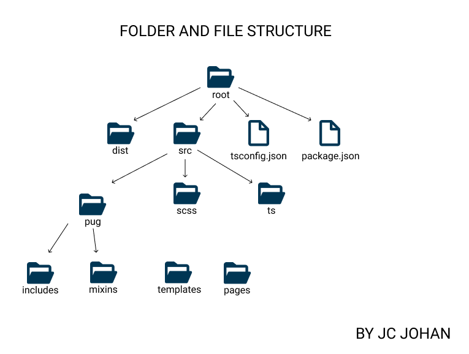
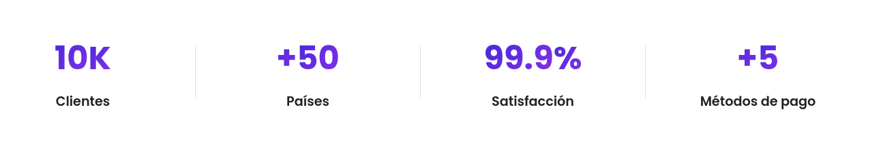

# Tarjeta Efectivo (Landing Page)

## **Documentation**

This project is developed under the [Easy Template library](https://github.com/johancastillo/easy-template), which is made up of the following technologies:

* **Pug** to write clean HTML code and embed logic

* **Sass** to write CSS code in a simpler and more scalable way

* **TypeScript**, a tool that offers us optional static typing in JavaScript, making our projects more powerful

### **Organizing folders and files**

* The **src** folder is the one that contains the code for the development of our template (Pug, Sass and TypeScript)

* The **dist** folder in which the compressed code will be generated for the deployment of the template



### **Project sections**

* **Counter Area**
    

    The code of this section is in **src/pug/includes/Counter.pug**
    ```js
    section.section.counter-area.ptb_50
            .container
                .row.justify-content-center

                    +counterItem(false, 10, 'K', 'Clientes')
                    
                    +counterItem(true, 50, false, 'Países')
                    
                    +counterItem(false, 99.9, '%', 'Satisfacción')
                    
                    +counterItem(true, 5, false, 'Métodos de pago')
    ```


### Install YARN
[Install yarn](https://classic.yarnpkg.com/en/docs/install#debian-stable)

### **Install dependencies**
Using `yarn`
```shell
$ yarn
```

### **Comands for project compilation**

```shell
$ bash commands/compile.sh
```


Autor: [Jc Johan](https://instagram.com/jcboxing2707)

